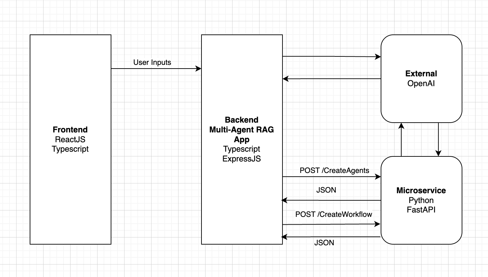
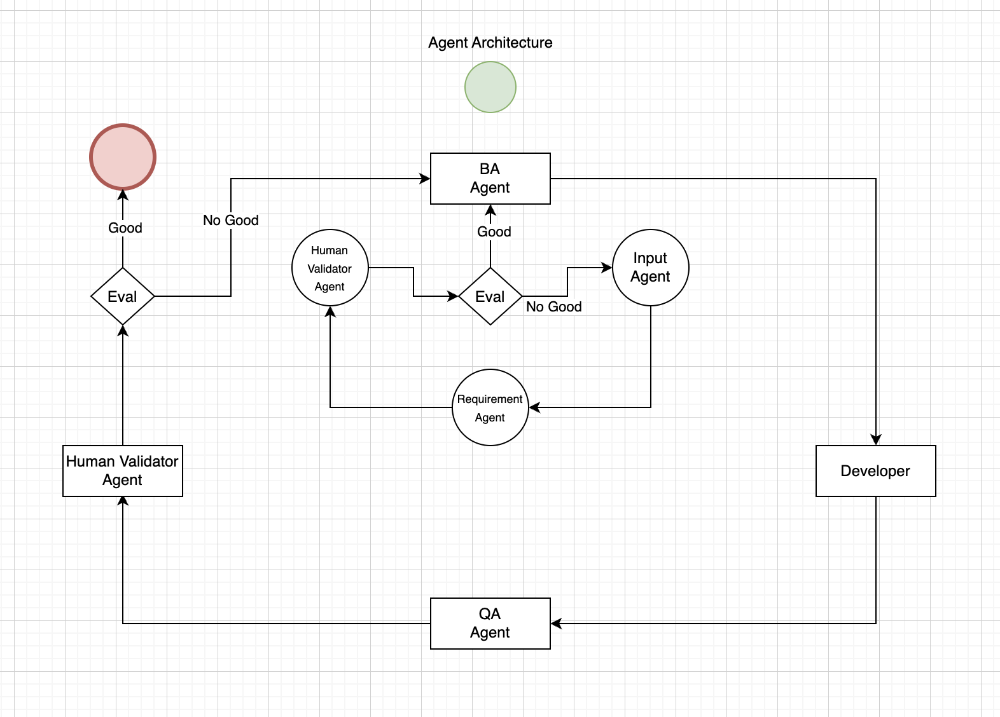

# Dynamic Agents
A microservice to create agents and LangGraph workflows

* Note: This service does not provide the LLM logic. This service will only create agents with a set of logic provided to the service

## Project Requirement
- Python 3.12

## System Overview
Refer to the following overview of this project and the visualized end goal.


### Internal process within Backend Multi-Agent RAG App
Refer to the following to visualize the flow within Backend Multi-Agent RAG App


## Basic Setup
```bash
# Create environment
python -m venv .venv

# Activate environment
source ./venv/bin/activate
# For windows
# .\venv\Scripts\activate

# .env setup
cp .env.sample .env

# Configure the values within .env

# Install dependencies
pip install -r requirements.txt

# Run the app
uvicorn main:app --reload
```
